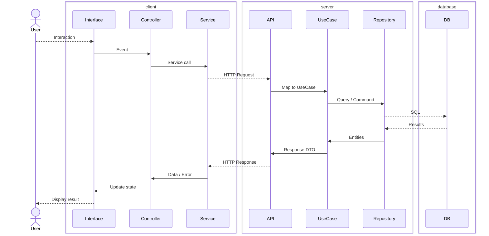

# Architecture

## Modules

> List the top-level modules and their responsibilities.

| Module  | Responsibility |
|---------|---------------|
| `db`    | Data layer — models, repositories, migrations |
| `api`   | Application layer — use cases, services |
| `app`   | Presentation layer — views, controllers |
| `infra` | Infrastructure — provisioning and deployment (transversal, optional) |

## Layers

```
app  →  api  →  db
```

- Each layer depends only on the layer below it.
- `db` has no dependency on `api` or `app`.
- `api` has no dependency on `app`.

`infra` is not part of this chain. It is transversal: it provisions and deploys
the layers above, so it knows them, but they never import `infra`. It is also
optional — a project is valid without it.

## Request flow

A single request traverses the layers as follows. The `client` box maps to the
`app` module, `server` to `api`, and `database` to `db`.



## Cross-cutting Concerns

- **Logging**: centralized logger injected via dependency injection.
- **Configuration**: environment-specific config loaded at startup.
- **Error handling**: typed error hierarchy defined in `api`; propagated to `app`.
